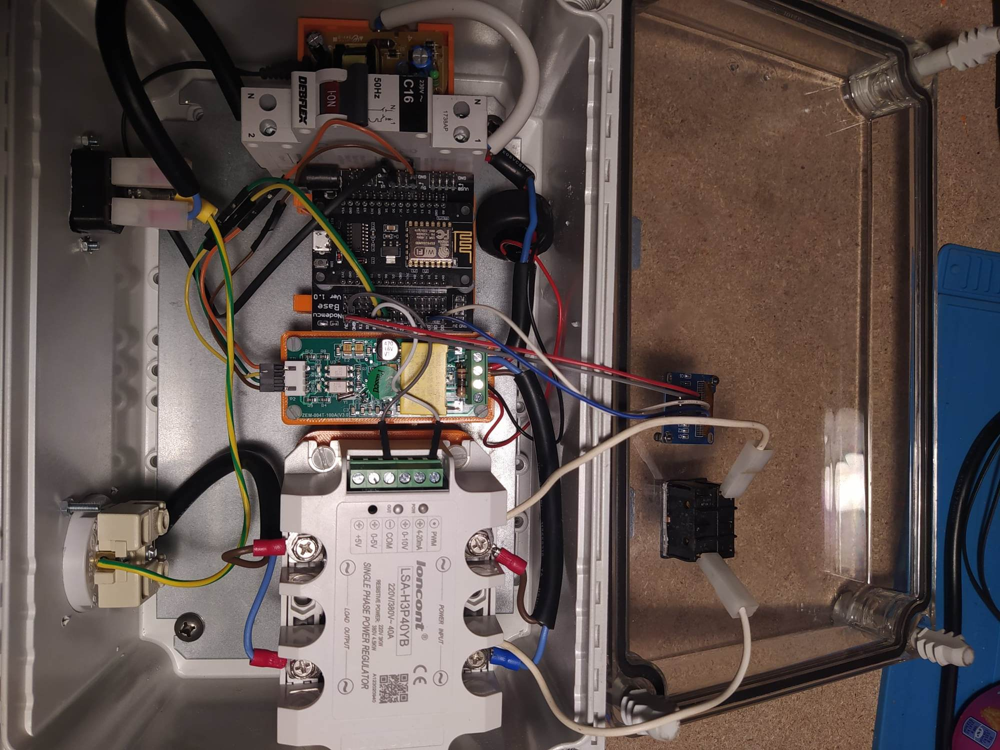
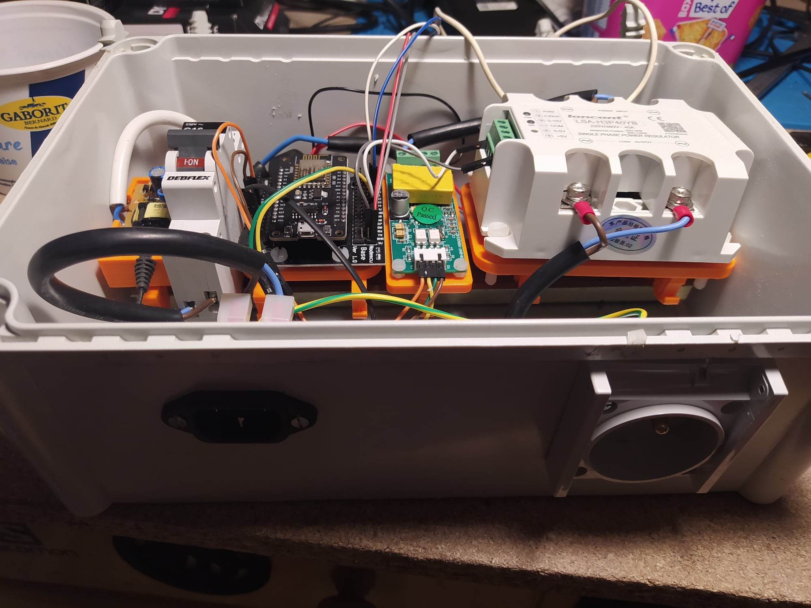
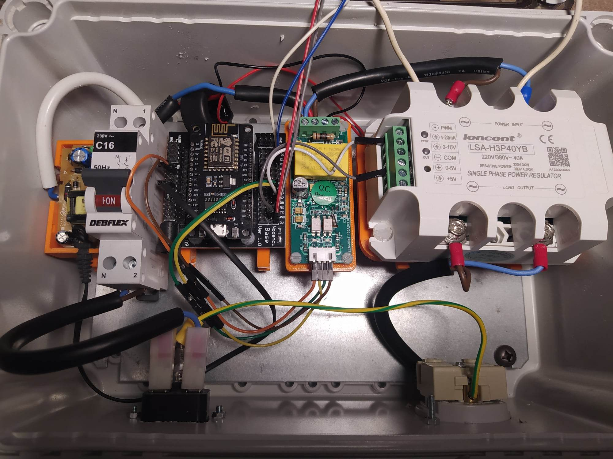
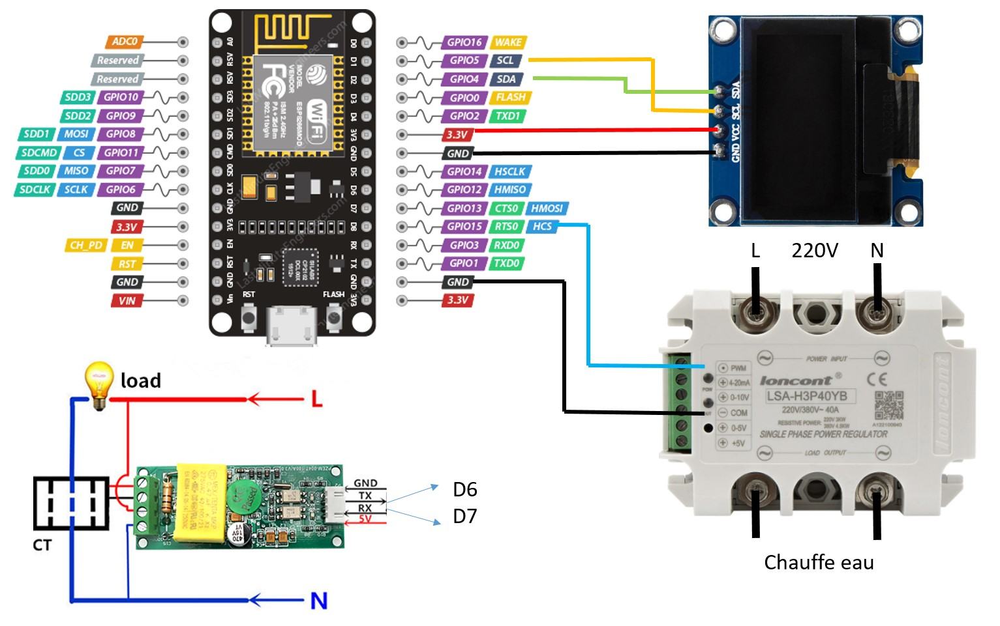

L'objectif du projet est de pouvoir piloter en puissance un appareil, ici le chauffe eau, via des requetes http.
Dans mon cas je l'utiliser pour consommer le surpplus de puissance généra par mes panneaux photovoltaiques.

Il va falloir 
 - un ESP8266 pour se connecter au réseau, attendre les commandes http et piloter le régulateur de puissance.
 - un régulateur de tension pilotage en PWM
 - un petit transfo AC/DC 220v/5v pour alimenter l'ESP8266
 - un disjonteur de sécurité
 - un voltmétre pour connaitre la puissance réelle consommée, permettant d'ajuster la commande en fonction de la consigne
 - un petit ecran pour afficher des infos interressantes
 - voyant, connecteurs 220v et une boite. 
tout est monté sur un rail DIN grave a des pièce imprimées en 3D (voir dossier CAD)

Régulateur de puissance (23€)<https://fr.aliexpress.com/item/32605706914.html?spm=a2g0o.order_list.order_list_main.4.51275e5bm8tN3l&gatewayAdapt=glo2fra>

Carte extension NodeMcu V3 ESP8266 + carte extension (6€)

<https://fr.aliexpress.com/item/1005002104682197.html?spm=a2g0o.order_list.order_list_main.11.51275e5bm8tN3l&gatewayAdapt=glo2fra>

voltmètre PZEM-004T (15€)

<https://fr.aliexpress.com/item/32405328185.html?spm=a2g0o.order_list.order_list_main.23.7f555e5bFQvT1a&gatewayAdapt=glo2fra>

Ecran oled (2€)

<https://fr.aliexpress.com/item/32665981269.html?spm=a2g0o.order_list.order_list_main.163.7f555e5bFQvT1a&gatewayAdapt=glo2fra>

